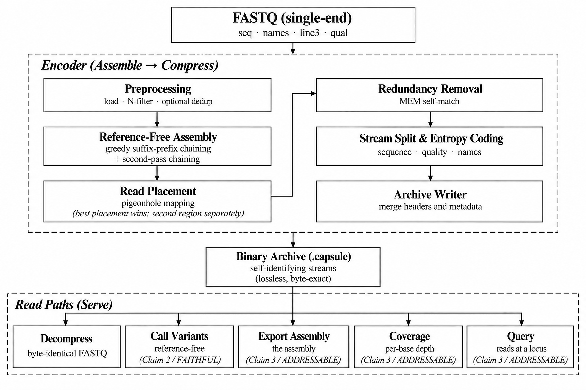

# G_CAPSUL: Genomic, Compact, Addressable, Pseudogenome-Structured, Unified Lossless

[](https://github.com/thackshanaramana0-spec/g_capsul/actions/workflows/ci.yml)
[](LICENSE)
[](#installation)
[](https://en.cppreference.com/w/cpp/17)
[](#results)

---

## The Problem

Lossless FASTQ compressors such as SPRING and Genozip focus on compact storage and exact
reconstruction, while the structure inferred during compression is not retained as a
general-purpose representation for downstream analysis. Reference-free variant callers such
as DiscoSNP++ and Kmer2SNP therefore rebuild related structure from the reads again. G_CAPSUL
targets this gap by retaining the compression-derived representation so that downstream
analysis can begin from the archive itself rather than rebuilding the underlying organization
from raw FASTQ, extending compression from a storage endpoint into a reusable substrate for
genomic analysis.

## Proposed Solution

G_CAPSUL follows the **ARCH design principle: Assemble, Retain, Compress, and Harness**.
During compression, it assembles a **pseudogenome** from the reads using greedy suffix-prefix
overlap chaining, pigeonhole mapping for the remaining reads, and self-matching to remove
residual redundancy. The resulting structure is retained inside the archive and reused for
three purposes:

1. **Compression (COMPACT)**: the pseudogenome, together with per-read placements, mismatches,
   and original read order, is entropy-coded into the smallest lossless archive among the
   three tools compared.
2. **Reference-free variant calling (FAITHFUL)**: the retained read organization is reused
   for variant analysis through aggressive collapse for SNV pileup and milder collapse for
   bubble and indel extraction, allowing heterozygous SNV, indel, and multi-allelic calling
   without constructing a second assembly.
3. **Archive-native addressability (ADDRESSABLE)**: the pseudogenome and retained placement
   information support `export`, `coverage`, and `query`, allowing sequence export, depth
   calculation, and coordinate-range read retrieval to begin from the archive rather than
   rebuilding the genomic organization from the original FASTQ.

## Key Features

- **Byte-exact lossless reconstruction**: sequence, read order, identifiers, quality scores, and line-3 mode are preserved, with every reported archive verified against the original input.
- **Smallest complete lossless archive** across 19 real datasets totaling 55.0 GB of FASTQ, with **19/19 wins against SPRING and 19/19 against Genozip**. Across all three tools, **57/57 archives reconstructed to byte-identical input**.
- **Reference-free variant calling from the archive** without returning to the original FASTQ, using a reference genome, or building a second assembly. Across four GIAB individuals, heterozygous-SNV mean F1 reached **0.876**, compared with 0.853 for DiscoSNP++ and 0.475 for Kmer2SNP.
- **Multi-allelic and higher-ploidy support**: G_CAPSUL recovered **17/26** multi-allelic sites in the complete chromosome-20 census, while DiscoSNP++ produced no complete multi-allelic records. On a tetraploid dataset formed from real HG003 and HG004 reads, G_CAPSUL achieved SNV F1 **0.897** versus 0.782.
- **Archive-level addressability**: pseudogenome export was **129–784×** faster than SPAdes, and per-base coverage was **16–54×** faster than BWA+mosdepth. The `query` operation also recovers both allelic read sets at heterozygous loci even when compression separates them across different pseudogenome coordinates, succeeding at **1,452 of 1,452** tested sites across four individuals and two loci.

---

## Contents

- [Repository layout](#repository-layout)
- [Results](#results)
- [Quick Start](#quick-start)
- [Installation](#installation)
- [Usage](#usage)
- [Configuration](#configuration)
- [Design](#design)
- [Reproducibility](#reproducibility)
- [Limitations](#limitations)
- [Citation](#citation)
- [License](#license)

---

## Repository layout

```
src/, include/    the shipped encoder and decoder: assembly, mapping, stream coding,
                  the FAITHFUL variant caller, and export/coverage/query
scripts/          build/test scripts, plus the full benchmark harness behind every
                  number in results/
thirdparty/       vendored PPMd7, FSE/Huf0, htscodecs/fqzcomp, each under its own license
results/          ** THE CITABLE NUMBERS **: per-claim CSVs plus generated plots
docs/             the curated, cross-verified reference tree: claim1/, claim2/, claim3/,
                  plus mechanism/novelty/limitations synthesis docs
Figures/          the manuscript figures
```

| you want | go to |
|---|---|
| **the master cross-reference: claim → figure → code → result → doc** | **[`docs/REPO_MAP.md`](docs/REPO_MAP.md)** |
| what's *not* claimed, explicitly | [`docs/honest_limitations_and_scope.md`](docs/honest_limitations_and_scope.md) |
| what's novel vs. prior art | [`docs/novelty_and_prior_art.md`](docs/novelty_and_prior_art.md) |
| the single canonical source for every locked number | [`docs/numbers_and_verification_index.md`](docs/numbers_and_verification_index.md) |

The manuscript itself and the full development history (experimental stages, machine
setup, dated reproduction logs) are not published in this repository. `docs/REPO_MAP.md`
explains that split in full. **Where a document and a result CSV disagree, the CSV wins.**

---

## Results

### Compression (COMPACT)

**Table 1.** Whole-file lossless archive (sequence + names + quality + line 3) on the 19
locked datasets, 55.0 GB of FASTQ spanning bacteria, archaea, viruses, fungi, protists,
plants, animals and human. Every archive decoded back to byte-identical input **before**
being counted; all 57/57 archives across the three tools verified LOSSLESS.

Percentage is how much smaller G\_CAPSUL's archive is than the competitor's, per row
(negative = smaller). All sizes in MB.

| dataset | original | G_CAPSUL | SPRING | Genozip | vs SPRING | vs Genozip |
|---|---:|---:|---:|---:|---:|---:|
| ERR5181310 | 471.18 | **8.68** | 9.98 | 9.22 | −13.06% | −5.88% |
| SRR554369 | 456.44 | **57.29** | 59.20 | 88.81 | −3.23% | −35.50% |
| ERR552797 | 431.08 | **46.97** | 52.13 | 82.80 | −9.90% | −43.27% |
| SRR2584863 | 695.16 | **68.43** | 74.09 | 114.59 | −7.64% | −40.28% |
| SRR29296997 | 210.23 | **15.66** | 17.54 | 27.23 | −10.71% | −42.49% |
| ERR12954017 | 333.14 | **15.16** | 17.00 | 39.43 | −10.79% | −61.54% |
| SRR065390 | 11282.99 | **887.41** | 942.64 | 1597.08 | −5.86% | −44.44% |
| SRR40271341 | 290.89 | **40.55** | 45.78 | 62.26 | −11.43% | −34.87% |
| ERR17740259 | 1336.96 | **83.20** | 92.40 | 161.81 | −9.96% | −48.58% |
| SRR37283774 | 1019.82 | **67.20** | 71.34 | 94.99 | −5.80% | −29.25% |
| DRR976266 | 2248.04 | **56.54** | 61.76 | 201.14 | −8.45% | −71.89% |
| SRR36741279 | 1661.16 | **106.25** | 117.62 | 194.66 | −9.67% | −45.42% |
| SRR32429602 | 1868.92 | **55.12** | 57.55 | 107.18 | −4.22% | −48.58% |
| SRR39257532 | 1761.85 | **108.27** | 153.86 | 227.02 | −29.63% | −52.31% |
| SRR10676752 | 15372.50 | **1650.03** | 1718.55 | 2954.90 | −3.99% | −44.16% |
| HG002 | 4279.20 | **573.77** | 598.19 | 951.00 | −4.08% | −39.67% |
| HG003 | 4279.57 | **567.12** | 591.14 | 944.22 | −4.06% | −39.94% |
| HG004 | 4279.33 | **606.19** | 634.75 | 1041.66 | −4.50% | −41.81% |
| HG005 | 6809.02 | **997.52** | 1081.38 | 1694.51 | −7.76% | −41.13% |
| **aggregate** | **59087.49** | **6011.37** | 6396.90 | 10594.52 | **−6.03%** | **−43.26%** |

**19/19 wins vs SPRING and 19/19 vs Genozip.**

Raw CSV: [`results/claim1/claim1_T1.1_T1.2.csv`](results/claim1/claim1_T1.1_T1.2.csv).
Full breakdown, including timing and peak memory: [`docs/claim1/`](docs/claim1/).

Separately, sequence-only content against PgRC2's own binary (the closest architectural
relative, GPL-3, run from its own source, never vendored): **+1.88% aggregate** on the
seven datasets both tools could process. That is a narrower measurement (PgRC2 stores no
names, no quality, and no line 3) and is deliberately not in the CSV above. The comparison
is limited to seven datasets, not the full non-human collection, because PgRC2 cannot
process the rest at all: attempting to run it on datasets with variable-length reads either
produces an explicit refusal or crashes, on six of the fourteen originally tested
non-human datasets. G_CAPSUL processes every one of these without modification, since
variable-length reads are an ordinary case throughout, not a special path. Full breakdown:
[`docs/claim1/mechanism_insight_claim1.md`](docs/claim1/mechanism_insight_claim1.md).

### Reference-free variant calling (FAITHFUL)

**Table 2.** Real GIAB HG002–HG005 chr20 at 30×, scored by third-party `rtg vcfeval`
against GIAB v4.2.1 inside the confident regions. **Every G_CAPSUL number here is called
from the compressed archive**: `capsule_decode call archive out.vcf`, with no FASTQ, no
reference and no separate assembly graph. Competitors get the identical reads, truth,
regions, normalisation and scorer; only the caller differs.

| comparison | G_CAPSUL | DiscoSNP++ | Kmer2SNP |
|---|---:|---:|---:|
| het-SNV F1 (mean of 4 individuals) | **0.876** | 0.853 | 0.475 |
| het-indel F1 (mean of 4) | **0.621** | 0.591 | not applicable (SNP-only by construction) |
| multi-allelic sites recovered | **17 / 26** | **0 / 26** | not applicable |
| tetraploid SNV F1 | **0.897** | 0.782 | not applicable |
| tetraploid indel F1 | **0.597** | 0.553 | not applicable |

Per individual, het-SNV: 0.888 / 0.891 / 0.891 / 0.834, **3 wins and 1 loss**, and the
loss is stated rather than averaged away. HG005 is the only variable-length dataset in the
set (250 bp quality-trimmed, 216 distinct read lengths, against 148 bp fixed elsewhere).
Truncating the same reads to 148 bp in a controlled diagnostic experiment raised its SNV F1
from 0.834 to 0.897, isolating read-length distribution as the cause. The published number
is the untruncated 0.834.
[`docs/claim2/t21_snv_claim2.md`](docs/claim2/t21_snv_claim2.md).

The multi-allelic row is a **complete census of chr20**, not a sample: 26 is every
SNV-only multi-allelic site there is. DiscoSNP++'s 0 is structural: across its entire
3,989-record output it emits no record with more than one ALT allele.

**Why reconciliation is necessary.** Lossless reconstruction alone does not guarantee that
the organization created for compression remains suitable for biological analysis. At a
heterozygous locus, reads supporting different alleles can be placed in separate,
internally-consistent pseudogenomic regions. Every read is still preserved exactly, but the
relationship identifying those reads as alternative forms of the same biological locus is no
longer explicit. G_CAPSUL therefore reconciles the separated regions before interpreting
their variant evidence. The full chr20 ablation isolates this effect:

| | F1 | Precision | Recall |
|---|---:|---:|---:|
| neither | 0.431 | 0.967 | 0.278 |
| re-placement only | 0.426 | 0.962 | 0.274 |
| collapse only | 0.648 | 0.963 | 0.488 |
| **both** | **0.888** | 0.956 | **0.830** |

The effect is synergistic, not additive: without collapse, precision remains above 0.96
while recall falls to about 0.27, consistent with variant evidence being separated rather
than incorrectly interpreted. Combining collapse with re-placement restores much of that
missing evidence, raising recall to 0.830 and F1 to 0.888. The correction operates during
analysis and does not alter the stored compressed representation, so it introduces **no
archive-size penalty**.

Raw CSVs: [`results/claim2/`](results/claim2/). Survey of why these two competitors
are the applicable ones, and the full mechanism behind the ablation:
[`docs/claim2/overview_claim2.md`](docs/claim2/overview_claim2.md),
[`docs/claim2/mechanism_insight_claim2.md`](docs/claim2/mechanism_insight_claim2.md).

### Archive-native addressability (ADDRESSABLE)

**Table 3.** G_CAPSUL reuses the representation already retained in the archive for sequence
export, per-base coverage, and locus retrieval rather than rebuilding the same organization
for each downstream task.

| operation | comparison | result |
|---|---|---:|
| export (pseudogenome as FASTA) | SPAdes v4.0.0 | **129–784× faster** |
| coverage (per-base depth) | bwa + samtools + mosdepth, timed as one pipeline | **16–54× faster** |
| query (reads at a locus) | no equivalent speed comparison | **locus-retrieval claim** |

**Read the export ratio with its correctness caveat.** Exported per-contig (using the
`contig_spans` stream, free at encode time), our export reaches **98.7% genome fraction**
against SPAdes's 98.3% and a **lower indel rate**, while SPAdes still wins on mismatch
rate, duplication ratio, and N50, real, disclosed gaps that trace to repeat resolution and
read error correction, the actual algorithmic content of a dedicated assembler, not present
in a pseudogenome built to minimize compressed size. The speed win is unconditional. The
correctness comparison is mixed and stated plainly as such, metric by metric, not
summarized as a win or a loss. Coverage carries no such caveat: the depth numbers are
exact, not estimated.

**`query` is not a speed claim, and we say so.** `genocat --head=100` extracts in 0.19 s
against our 0.46 s without an index, dropping to ≈0.03 s once an optional sidecar caches
the decoded pseudogenome and placements. What `query` does that nothing else can is resolve
a **locus**, not just a coordinate or a matching string.

#### Locus retrieval

A biological locus is not necessarily one coordinate in a compression-derived pseudogenome.
At heterozygous sites, reads carrying different alleles can be placed on disconnected
pseudogenomic regions, so querying a single stored coordinate can recover only part of the
biological evidence. G_CAPSUL reconciles these separated regions and retrieves the read sets
belonging to the same locus:

| individual | locus | sites | archive alone | with completion index |
|---|---|---:|---:|---:|
| HG002 | chr20:3.0–3.6 Mb | 400 | 400/400 | 400/400 |
| HG003 | chr20:3.0–3.6 Mb | 335 | 335/335 | 335/335 |
| HG004 | chr20:3.0–3.6 Mb | 400 | 399/400 | **400/400** |
| HG005 | chr20:3.0–3.6 Mb | 317 | 317/317 | 317/317 |
| HG005 | chr20:4.0–4.6 Mb | 400 | 400/400 | 400/400 |
| **all** | two loci | **1,452** | **1,451/1,452 (99.93%)** | **1,452/1,452 (100%)** |

A heterozygous locus is **not one place** in a compression-optimal pseudogenome: reads
carrying the two alleles are routinely placed on different, disconnected pseudogenomic
segments, occasionally many megabases apart. `query` resolves this by probing each site
from both upstream and downstream and combining the two retrieved read sets, recovering
both alleles at every site but one using the archive alone. The single native miss, in
HG004, was diagnosed rather than left unexplained: the alternate-allele reads differed from
the pseudogenome consensus by an indel rather than a substitution, so they were placed
elsewhere at compression time, beyond a positional query's reach at any tolerance. An
optional **completion index**, built after compression from placements and deviations the
archive already retained, matches by reconstructed read content instead of position and
closes exactly this gap, at a real, disclosed cost: false positives on homozygous
negative-control sites rise measurably wherever it is applied.

Same exact-match question against BWT-family tools (BEETL, CIndex): archive-alone recall
was 1.0000 on HG002 but only 0.86–0.96 on the other three individuals, confirming that
completeness there is not free either without the same completion index, which restores it
to 1.0000 on all four.

This is distinct from exact-sequence search: finding a matching sequence does not
necessarily identify other disconnected pseudogenomic regions representing the same
biological locus. The ADDRESSABLE claim is therefore about **biological locus retrieval
from the retained archive**, not query speed.

Full traceability: [`docs/claim3/`](docs/claim3/): `t31_export_claim3.md` through
`t35_locus_retrieval_claim3.md`, plus `mechanism_insight_claim3.md` for the full argument
and `code_mapping_claim3.md` for exact function and line references.

---

## Quick Start

```bash
git clone https://github.com/thackshanaramana0-spec/g_capsul.git
cd g_capsul
scripts/build106.sh /tmp/best106            # build the encoder (must link -fopenmp, see the script's own note)
scripts/build_decode.sh /tmp/capsule_decode # build the decoder + all three Claim 3 operations
scripts/verify_lossless.sh path/to/any.fastq # encode, decode, and diff against the original
```

Self-contained: needs nothing but this checkout, a C++17 compiler, and `liblzma-dev`
(`sudo apt-get install build-essential liblzma-dev` on Ubuntu/Debian). `verify_lossless.sh`
diffs the decoded output against your original FASTQ byte for byte: the same check every
number in [`results/`](results/) was required to pass before being counted. `scripts/` also
ships the full benchmark harness behind every locked-dataset number; see
[Reproducibility](#reproducibility) below for what running that needs beyond this checkout.

---

## Installation

**Docker**: no local build needed, pull the published image:

```bash
docker pull ghcr.io/thackshanaramana0-spec/g_capsul:1.1.0    # or :latest
docker run --rm -v "$PWD":/data ghcr.io/thackshanaramana0-spec/g_capsul:1.1.0 \
    capsule_decode /data/out.capsule /data/outdir /data/outdir/reads.fq
```

Or build the image yourself from source (same two-stage `Dockerfile` CI uses):
`docker build -t g_capsul .`. Every mode (`best106`/`export`/`coverage`/`query`/`call`/
`index`) works the same way: swap the command after the image name. This is re-verified on
every push and every release, not just built once
([`.github/workflows/ci.yml`](.github/workflows/ci.yml),
[`.github/workflows/publish-image.yml`](.github/workflows/publish-image.yml)).

**Source build**: see [Quick Start](#quick-start) above for the exact commands.
Benchmark/comparison tools (SPRING, Genozip, PgRC2, DiscoSNP++, Kmer2SNP, MEGAHIT, SPAdes,
bwa, samtools, mosdepth, rtg-tools) are separate, with exact, verified install commands in
[`docs/extras/SERVER_SETUP_AND_DOWNLOADS.md`](docs/extras/SERVER_SETUP_AND_DOWNLOADS.md).

**Bioconda**: a recipe is submitted and under review:
[bioconda/bioconda-recipes#69631](https://github.com/bioconda/bioconda-recipes/pull/69631),
all CI checks passing (lint, Linux, macOS, ARM), waiting on a maintainer merge. Once merged:
`conda install -c bioconda g_capsul`. Until then, use Docker or a source build above: they
already give the exact same binaries.

---

## Usage

```bash
# Compress (sequence + read order only: the default, NOT a full FASTQ)
INPUT=reads.fq ARCHIVE=out.capsule BEST=/tmp/best106 bash scripts/encode_adaptive.sh

# Compress the FULL FASTQ (sequence + names + quality + line 3)
CAPS_NAMES=1 CAPS_QUAL=1 INPUT=reads.fq ARCHIVE=out.capsule BEST=/tmp/best106 \
    bash scripts/encode_adaptive.sh

# Decompress (byte-exact round trip)
/tmp/capsule_decode out.capsule outdir outdir/reads.fq

# Reference-free variant calling, fused with compression (single pass)
CAPS_CALL=1 CALL_VCF=calls.vcf /tmp/best106 reads.fq 3 16 16 22 16 16 1 24 64 1

# Multi-allelic / polyploid calling
CAPS_CALL=1 CAPS_PLOIDY=4 CALL_VCF=calls.vcf /tmp/best106 reads.fq 3 16 16 22 16 16 1 24 64 1

# Addressable archive operations: each reads the SAME archive independently
/tmp/capsule_decode export   out.capsule contigs.fa
/tmp/capsule_decode coverage out.capsule coverage.tsv
/tmp/capsule_decode query    out.capsule region.fa 0-100000
```

Exact function and line references for every operation, organized by claim:
[`docs/claim1/code_mapping_claim1.md`](docs/claim1/code_mapping_claim1.md),
[`docs/claim2/code_mapping_claim2.md`](docs/claim2/code_mapping_claim2.md),
[`docs/claim3/code_mapping_claim3.md`](docs/claim3/code_mapping_claim3.md).

---

## Configuration

Exactly what each configuration puts in the archive and gives back on decode, including the
important point that the default is sequence-only, not a FASTQ:

| you set | what's IN the archive | what decoding gives you |
|---|---|---|
| *(nothing, the default)* | sequence + read order only | sequence only: no names, no quality, no `+` line |
| `CAPS_NAMES=1` | + names/read-ID column | `<outreads>.names` in addition |
| `CAPS_QUAL=1` | + quality scores | `<outreads>.qual` in addition |
| `CAPS_NAMES=1 CAPS_QUAL=1` | full FASTQ content | a full 4-line FASTQ, verified byte-identical (same MD5) to the original |
| `CAPS_CALL=1` | no archive change, writes a VCF as a side effect | `$CALL_VCF` gets heterozygous SNV/indel calls, combinable with any of the above |

---

## Design



The encoder follows **ARCH: Assemble** a pseudogenome from the reads by greedy suffix-prefix
chaining and pigeonhole placement, **Retain** that structure instead of discarding it after
compression, **Compress** it into a self-identifying binary archive via MEM self-match and
per-stream entropy coding, and **Harness** the same retained structure for every read path:
decompress, call variants (FAITHFUL), and export/coverage/query (ADDRESSABLE), all served
from the one archive with no second assembly.

### Algorithmic contributions

- **Multi-region pseudogenome assembly.** Greedy exact suffix-prefix chaining builds a main
  region from well-tiling reads; leftovers are pigeonhole-mapped or assembled into a second
  region; both regions are self-matched to remove residual redundancy.
- **Dual-substrate variant calling.** The same contig set is rebuilt at two collapse
  aggressiveness levels: one tuned for reliable minor-allele-fraction estimation in SNV
  pileup, one left closer to its pre-collapse form to preserve the two-path bubble structure
  indel calling needs.
- **Positional-clustering indel channel.** An eBWT2SNP-inspired channel clusters reads by a
  right-context anchor unique across the contig set, catching indels neither pileup nor
  bubble extraction reaches alone.
- **Hoisted, index-only coverage.** `coverage` needs only the pseudogenome's length and every
  read's placement, not its content, so it runs entirely before the pseudogenome is
  rebuilt, skipping the cost export and query both pay.
- **Adversarial correctness discipline.** Every silent data-loss bug this project has found
  (mismatch positions above 256bp, orphaned unique-read desync, reverse-complement
  contained-read indexing, an FSE-RLE decode defect, a broken default export path) was
  found by actually decoding archives and diffing against the original file, or by scoring
  export against a real reference, not by trusting a passing size table. Full trail:
  [`docs/claim1/mechanism_insight_claim1.md`](docs/claim1/mechanism_insight_claim1.md),
  [`docs/claim3/t31_export_claim3.md`](docs/claim3/t31_export_claim3.md).

---

## Reproducibility

Every number in [`results/`](results/) traces to a script and a raw CSV; the full map from
claim to figure to code to result to doc is [`docs/REPO_MAP.md`](docs/REPO_MAP.md), and
`docs/` itself (`claim1/`, `claim2/`, `claim3/`) holds the per-claim writeups. Full datasets
are not stored in this repository: exact, verified download commands for every dataset and
comparison tool are in
[`docs/extras/SERVER_SETUP_AND_DOWNLOADS.md`](docs/extras/SERVER_SETUP_AND_DOWNLOADS.md), and
the benchmark harness that drives the DiscoSNP++/Kmer2SNP/SPAdes/bwa+mosdepth comparisons
ships in `scripts/` alongside the core build/test scripts, needing only the locked dataset
manifests ([`docs/extras/NEW_DATASET_LOCKED.md`](docs/extras/NEW_DATASET_LOCKED.md)) and the
external comparison tools to run. Development history (experimental stages, machine setup,
dated reproduction logs) is intentionally not published in this repository; `docs/REPO_MAP.md`
explains that split. **Where a document and a result CSV disagree, the CSV wins.**

---

## Limitations

- **Human validation is chr20 only, at 30×.** Claims 2 and 3 are measured on four GIAB
  individuals across the whole chromosome, not on windows, but it is one chromosome,
  because the archives are chr20. Nothing here is evidence about whole-genome behaviour.
- **No non-human diploid variant validation.** The 15 non-human datasets carry Claim 1
  only; there is no comparable truth set for them.
- **HG005 loses, and we publish the loss.** It is the only variable-length dataset in the
  calling set, and a controlled truncation experiment identified read-length distribution
  as the cause without changing anything in the caller itself
  ([`docs/claim2/t21_snv_claim2.md`](docs/claim2/t21_snv_claim2.md)).
- **Compression is slower than SPRING and Genozip**, and heavier on peak memory. Genozip
  is fastest on 18 of 19 compressions and all 19 decompressions. Assembly costs time and
  memory, and that cost is what Claims 2 and 3 spend for free afterward.
- **`query` is not a speed win** against `genocat --head` without an index, and Table 3
  says so rather than leading with the indexed ≈0.03 s.
- **The completion index is not a free win.** It closes real gaps in both exact-match
  recall and locus retrieval, but it measurably raises the false-positive rate on
  homozygous negative controls everywhere it is applied. Reported alongside the
  completeness result, not omitted.
- **PgRC2's own pseudogenome has not been tested for the same allele-splitting behaviour.**
  The argument that it would exhibit it is structural, from its confirmed architecture, not
  an empirical finding from running PgRC2 itself on heterozygous data.

Full, current status for each claim: [`docs/claim1/overview_claim1.md`](docs/claim1/overview_claim1.md),
[`docs/claim2/overview_claim2.md`](docs/claim2/overview_claim2.md),
[`docs/claim3/overview_claim3.md`](docs/claim3/overview_claim3.md), and the single
cross-claim source for every scope boundary that must be disclosed:
[`docs/honest_limitations_and_scope.md`](docs/honest_limitations_and_scope.md).

---

## Citation

If you use G_CAPSUL in your research, please cite:

> Thackshanaramana B (2026). *G_CAPSUL: a unified pseudogenome for lossless FASTQ
> compression, reference-free variant calling, and archive-native addressability.*
> Manuscript in preparation.

To cite the exact code version used, see [`CITATION.cff`](CITATION.cff) (GitHub's own "Cite
this repository" button reads this automatically) or reference a tagged
[release](https://github.com/thackshanaramana0-spec/g_capsul/releases) directly. Current
release: [v1.1.0](https://github.com/thackshanaramana0-spec/g_capsul/releases/tag/v1.1.0).

**Author:** Thackshanaramana B, SRM Institute of Science and Technology.

---

## License

**MIT**: see [`LICENSE`](LICENSE) for the full text.

Vendored third-party code keeps its own license, all of them MIT-compatible;
full table and terms in [`THIRD_PARTY_NOTICES.md`](THIRD_PARTY_NOTICES.md).

**PgRC2 (GPL-3) is deliberately NOT vendored.** It is used only as an external
comparison binary, cloned separately. No PgRC2 source is included in or linked
into this repository, so its GPL-3 terms do not attach here. That separation
was a design decision, not an accident: see
[`docs/extras/REIMPL_NOTES.md`](docs/extras/REIMPL_NOTES.md), which records
that PgRC2's assembler was reimplemented from the algorithm rather than
copied, precisely so this stays true.
