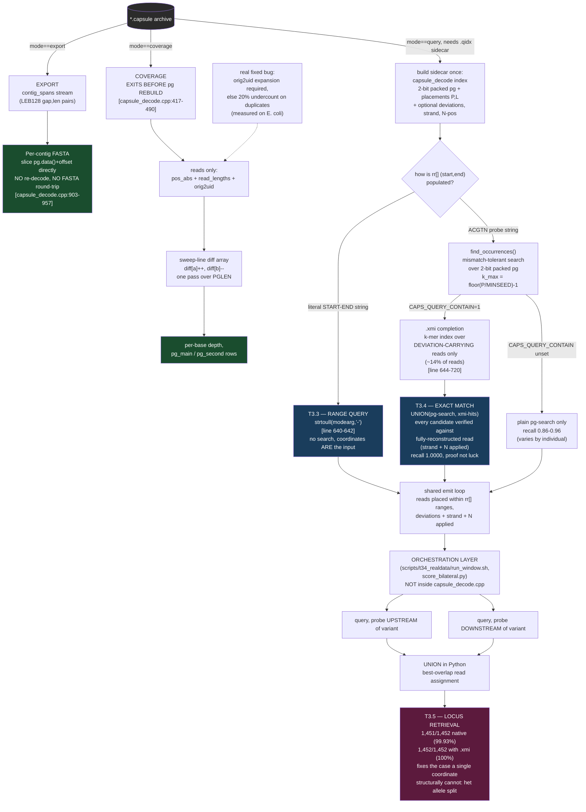

# Claim 3 (ADDRESSABLE) — architecture diagram, source

**Status: DRAFT CONTENT ONLY. Not wired into the manuscript, not finalized.**
Written so the diagram can be rendered/refined without re-deriving the code
trace. Every box below is anchored to an exact function or line range in
`stages/capsule_decode.cpp`, verified this session, not recalled from memory.

---

## The real shape (not five parallel boxes)

Five published tables (T3.1-T3.5) come out of **four actual code paths**,
because T3.3 and T3.4 are the same function with different inputs, and T3.5
is not in the C++ at all — it is an orchestration pattern built by calling
T3.4's primitive twice.

---

## Why the shape matters (the point of drawing it this way)

A naive diagram — five boxes side by side, one per table — would imply five
bespoke mechanisms, which is not what the code does and undersells the
actual claim. The real structure is:

1. **Two fast-exit paths** (export, coverage) that skip the assembly layer
   entirely, because they don't need pg *content* — only its length,
   placements, or precomputed spans.
2. **One shared query primitive**, used three different ways depending only
   on what fills `rr[]` — literal coordinates, a pg-search, or a pg-search
   unioned with an auxiliary index.
3. **One orchestration layer** (T3.5) that calls the primitive twice and
   reconciles the results — this is where the paper's actual insight
   (allele-splitting) gets fixed, and it is built entirely on top of
   mechanism #2, not a new one.

That's a stronger, truer picture than "five features": one retained
structure, reused through one primitive, in increasingly demanding ways —
which is the sentence the abstract already makes. The diagram should prove
it, not just illustrate five tables.

## What still needs deciding before this is final

- Visual style (this is Mermaid syntax — renders as a flowchart; may need
  redrawing in whatever tool matches Claim 1/Claim 2's diagrams for visual
  consistency).
- Whether to show the `.qidx` sidecar build step explicitly (currently
  folded into the "build sidecar once" box) or expand it, given `CAPS_XMI`
  and `CAPS_PILEUP` are separate opt-in flags at index-build time, not part
  of every sidecar.
- Level of code-citation detail to keep visible in the final image vs. move
  to a caption — current draft keeps line numbers inline for traceability
  during review; likely too dense for the camera-ready version.

Not wired into `capsul_manuscript.tex`. Not rendered as an image file yet.
