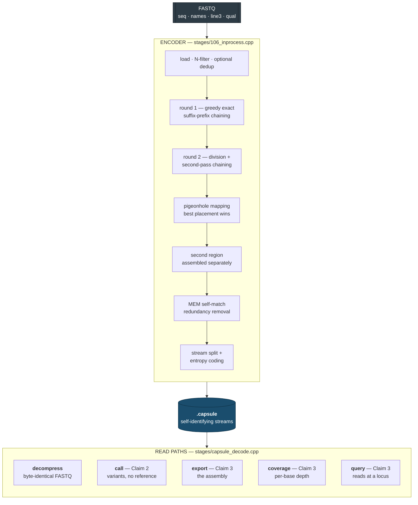
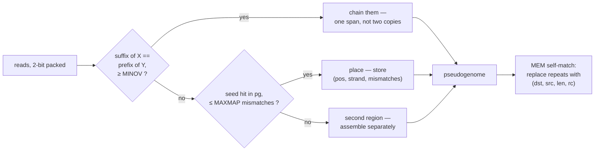
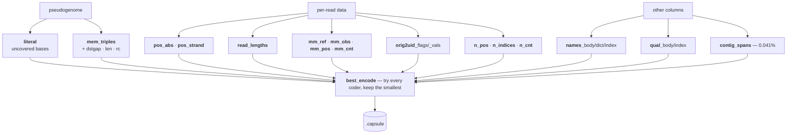
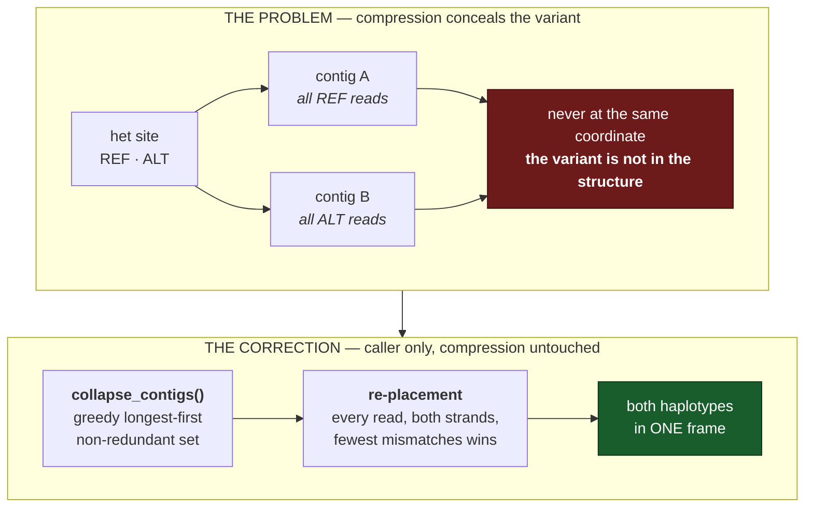
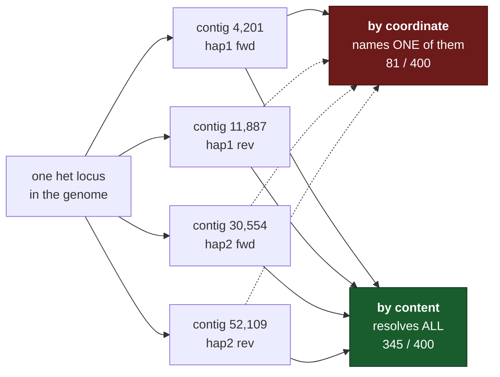

# ARCHITECTURE — the system, in diagrams

> **Status:** frozen 2026-09-10 at tag `v1.0.2-capsule` — code and results final.
> Authoritative numbers live in `../benchmark/results/`; verification status in
> [`../AUDIT.md`](../AUDIT.md). Where this file and a result file disagree, the result file wins.

Condensed from `docs/TECHNICAL_ARCHITECTURE.md` (625 lines), `docs/FORMAT.md`,
`docs/CAPSULE_FORMAT.md` and the shipped source. Where this file and the code
disagree, the code wins; where the code and a result file disagree, the result
file wins.

Two binaries. One archive format. Three claims are three read-paths out of one
structure, not three tools.

---

## 1. The whole system



**The thesis in one line:** Assemble → Retain → Compress → Serve. Every other
tool in this family performs the first step and discards its result.
NanoSpring's own paper: the assembly is *"strictly a compression intermediate
... not preserved or made available for downstream genomic analysis."*

---

## 2. Assembly — how the pseudogenome is built



### The sweep starts at `Lmax`, not `Lmax−1` — the single most important fix

A suffix-prefix overlap of *exactly* the read length **is** an exact duplicate,
and that is the only length at which one can appear: two identical 251-base
reads do not overlap at L = 250. Starting one below made duplicates structurally
invisible to chaining, forcing a separate pre-assembly dedup pass with its own
`orig2uid`-shaped cost.

Starting at `Lmax` cut one pseudogenome **9,134,100 → 6,157,270 bytes** and
turned the project's last remaining size loss into a win. (Commit `3e06957`.)

### Placement keeps the best match, and the bound is free

A candidate is abandoned the moment it is worse than what the read already
holds, so better placements also mean *less* work. Measured on the reimplementation
progression: first-acceptable placement gave 10.74 mismatches/read; best-match
gave **4.94**, at a total below PgRC2's own 1,369,413.

### The coverage ramp — a formula, not a constant

`MAXMAP` widens as a function of `leftover_frac`, the fraction of reads that
failed round-1 chaining — a property of *this* input, computed fresh every run,
with the threshold set safely above every locked dataset's measured value so
normal-coverage behaviour is provably byte-identical.

---

## 3. The archive — streams and their coders



**Streams are self-identifying by name, not by position.** The decoder reads
them into a map and looks each up by name, so adding a stream cannot shift
another's offset — the exact property a positional format lacked, which broke
silently once.

### The selector

| id | coder | suited to |
|---|---|---|
| 0/1 | xz (LZMA) | general baseline |
| 2 | PPMd7 (LZMA SDK, public domain) | text-like |
| 3 | FSE (Yann Collet, BSD) | skewed small alphabets |
| 4 | project's own adaptive range coder | period-1 streams |
| 5/6 | u32 byte-plane split + xz/lzma | positions, deltas |
| 7 | chunked — split, encode each, concatenate | large heterogeneous |
| — | `CONST_MARKER` | one value × N → ~9 bytes total |

Two coders are *not* general-purpose and matter:

- **`literal`** — an adaptive order-*k* context model over ACGT, shared via
  `seqpar_core.h` so the standalone and in-process paths cannot diverge.
  Multi-order logistic mixing reached **1.9174 bits/base** against PgRC2's
  1.9261 on identical input.
- **`mm_ref`/`mm_obs`** — an adaptive model keyed on the reference base (4
  possible refs → a 3-symbol "not-ref" alphabet), not an independent per-mismatch
  code. This is where **40%** of PgRC2's mismatch-symbol cost was beaten
  (124,280 B vs 208,234 B on the same data).

### Names and quality

Names use a SPRING-style positional tokenizer with two additions of our own:
`ID_ZDELTA` (a wider signed delta, gated on a self-learning per-token-index
track record) and **`ID_SEQLEN`** — a `length=NNN` token whose value *is* the
read's own length, which the archive already stores in `read_lengths`. Coding it
inside the name pays twice for one fact; the token carries no payload at all.
Measured **−96.5%** on a dataset where that token dominated.

Quality **vendors** fqzcomp/htscodecs (BSD 3-clause), rather than
reimplementing. Our own quality coder beats SPRING 7/8 and Genozip 8/8 but loses
to real fqzcomp on all 8 — and the license permits vendoring, unlike PgRC2
(GPL-3), which is why *that* had to be rebuilt from scratch.

---

## 4. Claim 2 — why calling needs two extra passes



**Why two internally-consistent contigs and not one:** two clean contigs
compress better than one contig plus a column of disagreements. The compressor
is not making a mistake — it is doing its job, and its job deforms the structure.

**The ablation proves it is the mechanism, not a fit** (full chr20, HG002, from
the archive):

| configuration | F1 | precision | recall |
|---|---|---|---|
| neither | 0.431 | 0.967 | 0.278 |
| re-placement only | **0.426** | 0.962 | 0.274 |
| collapse only | 0.648 | 0.963 | 0.488 |
| **both** | **0.888** | 0.956 | 0.830 |

Two things a single number could not show. **Re-placement alone is worse than
doing nothing** — +0.217 and −0.005 alone, +0.457 together: synergy, not
additivity. And the **error shape** confirms the cause: without collapse,
precision *holds* at 0.96 while recall collapses to 0.27. The caller is not
mistaken, it is **blind** — which is what "the alt reads are on another contig"
predicts. Noise or a bad threshold would cost precision instead.

**And it costs nothing in compression ratio.**

---

## 5. Claim 3 — why a coordinate cannot name a locus



Median **4** parallel places per het locus (two haplotypes × two strands),
measured up to **18.6 Mb apart** in the pseudogenome. The archive's own
coordinate system therefore cannot name a locus — and **adding a coordinate API
would not fix it.** That is what 81/400 measures: the obvious engineering answer,
failing for a structural reason, and it is the same reason Claim 2 identified.

### Three operations, three different early exits

| operation | decodes | never touches |
|---|---|---|
| `export` | `literal` + `mem_triples` (+ companions) → the pseudogenome | any per-read stream |
| `coverage` | `pos_abs` + `read_lengths` → difference-array depth | **no pseudogenome content at all** — hoisted above the rebuild |
| `query` | the assembly layer + placements, then stops | quality, names, full read reconstruction |

**A standing trap, recorded because it caused a real bug:** `pos_abs` is indexed
by UNIQUE read; `read_lengths` by ORIGINAL read. Walking both with one loop
counter is correct only when there are zero duplicates — the first `coverage`
did exactly that and silently undercounted depth by 20% on E. coli.

---

## 6. Decoder ordering — one subtlety that was a real bug

References are replayed onto the pg buffer in order, and each reference's own
extension mismatches must be applied **immediately after its copy and before the
next reference's copy can read those bytes**. A batch decode-then-apply approach
reads stale bytes whenever a later match's source falls inside an earlier
match's destination — which is routine in tandem repeats.

---

## 7. Build

```bash
scripts/build106.sh     /tmp/capsule_enc    # encoder — must link -fopenmp
scripts/build_decode.sh /tmp/capsule_dec    # decoder
```

Both compile the vendored C sources with `gcc`, not `g++` (the vendored code
relies on implicit `void*` conversions that C++ rejects), then link the objects
into the C++ binary. Without `-fopenmp` the single `#pragma omp parallel for` is
silently discarded and the largest stage runs serial — worth −45% wall time, and
the reason the build lives in a script instead of shell history.
